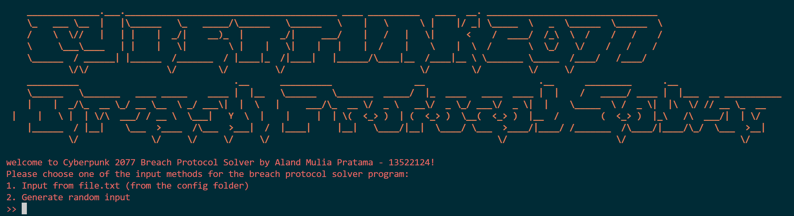
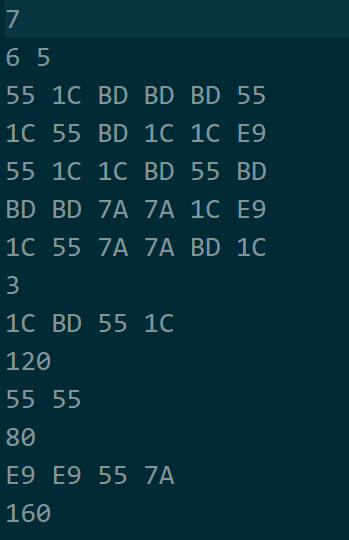
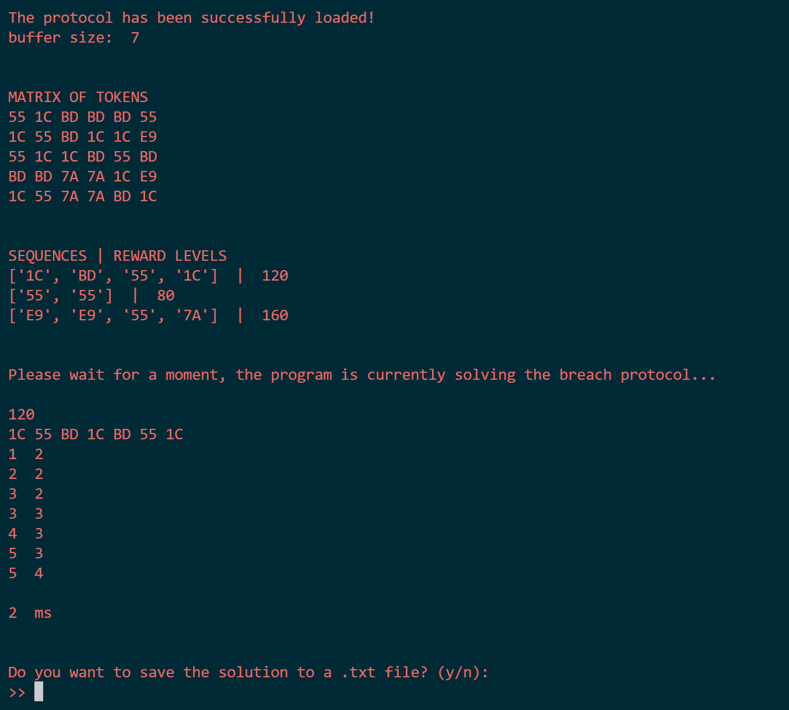
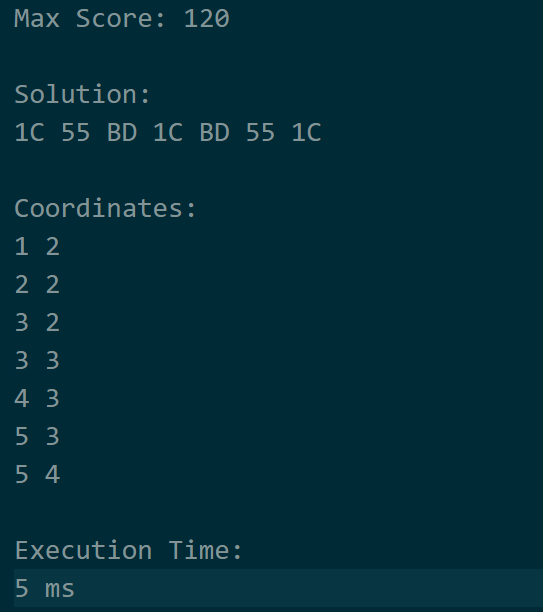

<div align="center">
  
</div>

# Tucil1_13522124
> Cyberpunk 2077 Breach Protocol Solver with **Brute Force Algorithm**
## 📑Table of Contents
  - [Description](#%EF%B8%8F-description)
  - [Technologies Used](#-technologies-used-dependencies)
  - [Installation](#-installation)
  - [How to Run](#%EF%B8%8F-how-to-run)
  - [Features](#-features)
  - [Structure](#%EF%B8%8F-structure)
  - [Screenshots](#-screenshots)
  - [Contributor](#-contributor)

## 🖥️ Description
Cyberpunk 2077 Breach Protocol is a hacking minigame in the video game Cyberpunk 2077. This minigame is a simulation of hacking a local network from ICE (Intrusion Countermeasures Electronics) in the game Cyberpunk 2077. This **Python Language Program** can find the most optimal solution to the Breach Protocol game with any combination of matrix, sequence, and buffer size using the **brute force algorithm**.

## 🦾 Technologies Used (Dependencies)
- Python Programming Language

## 🔧 Installation
Python Installation:
1. Visit the official Python website at https://www.python.org/downloads/ and download the version of Python that suits your operating system.
2. Make sure to select the "Add Python to PATH" option during the installation process.
3. Select the location where Python will be installed. By default, Python will be installed in the `C:\Program Files\Python<version> directory`.
4. After the installation process is complete, open a terminal or command prompt, and type the command `python --version`. If Python is installed correctly, you will see the version of Python installed.

Colorama Library:
1. Execute `pip install colorama`.

## 🏃‍♂️ How to Run
1. Clone the repository to your local files. Access the repository [here](repository-link). Open the terminal and run `git clone  https://github.com/alandmprtma/Tucil1_13522124.git`
2. Ensure the directory is set to `Tucil1_13522124` and run `cd src` to change the directory to src folder.
3. Execute `python3 main.py`.
4. You can find the optimal solution by using input from `file.txt in config folder` or `generate random input`.

## 🏋 Features
The following are the features or commands contained in the Command Line Interface (CLI) Cyberpunk 2077 breach protocol solver program in the Python programming language along with a brief description of these features:
1. Input from file.txt

The game matrix can be generated by reading a file with the extension .txt which has the following format:
```bash
buffer_size
matrix_width matrix_height
matrix
number_of_sequences
sequences_1
sequences_1_reward
sequences_2
sequences_2_reward
…
sequences_n
sequences_n_reward
```
The following is an example of an input file.txt that can be used:
```bash
7
6 6
7A 55 E9 E9 1C 55
55 7A 1C 7A E9 55
55 1C 1C 55 E9 BD
BD 1C 7A 1C 55 BD
BD 55 BD 7A 1C 1C
1C 55 55 7A 55 7A
3
BD E9 1C
15
BD 7A BD
20
BD 1C BD 55
30
```


2. Generate random input

Matrix & sequences (along with their prize weights) can also be generated automatically by the program with input via CLI in the form of number of unique_tokens, token, buffer_size, matrix_size, sequence_number, and maximum_sequence_size (doesn't have to be in order). The output for this feature should display both the Matrix and the sequence game used.
```bash
5 // Number of unique_tokens
BD 1C 7A 55 E9 //token
7 //buffer_size
6 6 //matrix_size
3 //sequence_number
4 //maximum_sequence_size
```

## 🗂️ Structure
```bash
.
├── config
│   ├── input_1.txt
│   ├── input_2.txt
│   ├── input_3.txt
│   ├── nosolution_1.txt
│   ├── nosolution_2.txt
│   ├── nosolution_3.txt
│   └── spek.txt
├── doc
│   └── Tucil1_K3_13522124_Aland Mulia Pratama.pdf
├── img
│   ├── inputfile.png
│   ├── mainmenu.png
│   ├── solverview.png
│   ├── cyberpunk_2077.png
│   └── outputfile.png
├── src
│   └── main.py
├── test
│   ├── input_txt_1.txt
│   ├── input_txt_2.txt
│   ├── input_txt_3.txt
│   └── sortorder_initiating.pl
└── README.md
```

## 📸 Screenshots
### Main Menu
<div align="center">
  
  <p><i>Main Menu Display</i></p>
</div>

### Input file.txt
<div align="center">
  
  <p><i>Input with file.txt</i></p>
</div>

### Breach Protocol Solver Display
<div align="center">
  
  <p><i>Breach Protocol Solver Display</i></p>
</div>

### Output file.txt
<div align="center">
  
  <p><i>Output with file.txt</i></p>
</div>

## 🪪 Contributor
| Nama | NIM |
|---|---|
| Aland Mulia Pratama | 13522124 |